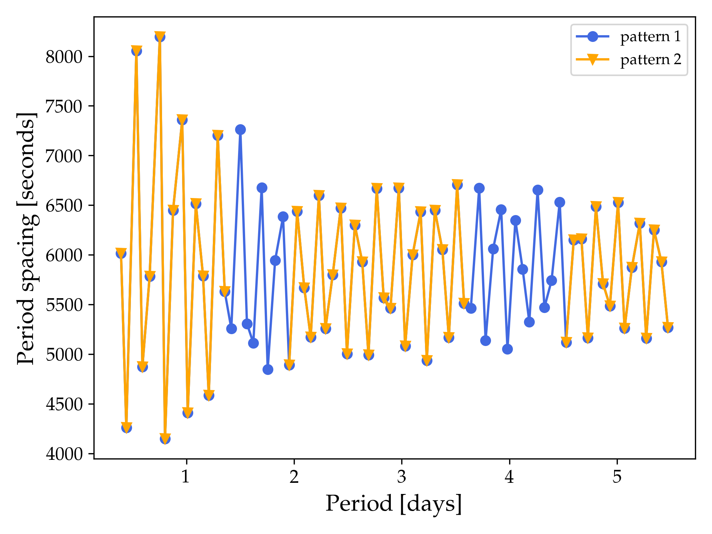
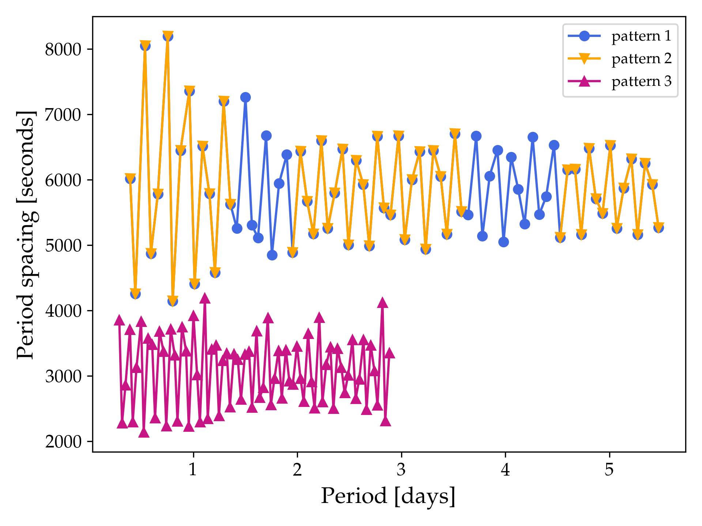

# Before getting started 

**Warning!** These `MESA` labs have been put together with both low time and spatial resolution for the sake of having the models be completed within a sensible timeframe for the summer school. Before any of these steps or result can be used in any type of actual science case, carrying out a convergence study is crucial!
 

In the following `MESA` lab exercises, you will see different text boxes and colours appearing at different times.  

Text boxes with black background will provide either some terminal commands or terminal output from your `MESA` and `GYRE` runs.

 Terminal commands or output 
 

A terminal command or output will appear here

The second type of text box has a white background, and lists example contents of different files that you need to use/modify or `fortran` coding examples.

 File name or type of fortran commands 
 

Text inside file or example fortran coding snippets go here.

Aside from the two types of text boxes, there are three different types of coloured text that you will need to pay attention to. <a href="https://docs.mesastar.org/en/release-r23.05.1/" target="_blank"> Text of this colour can be clicked</a> and will either take you to a website or give you downloadable content that you need for the exercise, including solutions to Minilab 1, Minilab 2, and the Maxilab. The remaining two types of text colours correspond to specific tasks that you have to complete and some useful hints along the way, click on them to expand the task or hint.

<task>

Task 0

This is an example of how a specific task will show up in the following <code>MESA</code> labs.

</task>

<hint>

 Hint 

This is an example of how hints to different tasks will show up in the text.

</hint>

Don't hesitate to use these hints if you get stuck at any point during the lab exercises or feel like you are falling behind! 
Finally, today's round of `MESA` lab exercises consists of two minilabs and one maxilab, which will take you through the following:  

[Minilab 1](./Minilab1.md): Building your starting `MESA` inlist and running `MESA` from a precomputed model. 

[Minilab 2](./Minilab2.md): Compiling and running `GYRE` outside of `MESA`. 

[Maxilab](./Maxilab.md): Implementing a different mixing profile in `MESA` using the `other_D_mix` hook inside `run_star_extras.f90`and including additional history output. 

We hope you all have fun and please don't hesitate to ask your TA for help! 

# For the TAs 
For Minilab 2 and the Maxilab, the TAs will be responsible for plotting the period spacing patterns based on the `GYRE` output summary files that the students create. The students are more than welcome to try this out themselves as well, but as a baseline the TAs should be able to do this for them to avoid wasting too much time getting the tools to work. The plotting tools that we are providing for this are written for `python`. There are two options for how to plot the patterns. You can either use a provided `Jupyter Notebook` or command line `python script`. Jupyter notebook and python script for plotting the period spacing patterns is available [here](https://raw.githubusercontent.com/MichielsenM/mesa-summer-school-2023/main/solutions/jupyter_notebook.zip) along with associated conda environment.

By clicking on the link above, you will see a number of different files including a `notes.txt` file with instructions first on how to install the relevant `conda` environment using the provided `patterns_py.yml`, and then how to use the `Jupyter Notebook` (`Plotting period spacing patterns.ipynb`) or `python script` (`plot_pattern_script.py`) to plot the patterns. We repeat these instructions below for your convenience, starting with installing the `conda` enviroment `patterns_py` using your terminal. Note that these instructions assume that you already have `Anaconda` <a href="https://docs.anaconda.com/free/anaconda/install/" target="_blank"> installed</a>.

 Installing conda environment option 1 
 

  
conda env create -f patterns_py.yml

If for some reason this does not work, then you can also install this environtment manually instead

 Installing conda environment option 2 
 

  
conda create --name patterns_py numpy matplotlib pandas jupyter

Once the environment is installed you can activate it using

 Activating the conda environment <code>patterns_py</code> 
 

  
conda activate patterns_py

Afterwards you can activate the `Jupyter Notebook` through the terminal using

 Activating Jupyter Notebook 
 

  
jupyter notebook

after navigating to where you saved the files in the link. This should automatically open a new tab in your browser where you just have to click on the file `Plotting period spacing patterns.ipynb` to look at and modify the notebook. 

A quicker way of plotting the patterns is to use the script `plot_pattern_script.py` which requires the same `conda` environment to be activated. Remember that you only need to activate the `conda` environment once. The script takes as input first a name for the saved figure and then up to 10 GYRE summary files. In other words the structure for running the script in the terminal is as follows: `python plot_pattern_script.py my_figure_file_name.png summary_file1.txt summary_file2.txt`. You can plot a specific example using the provided files in the same link using the following

 Example use of <code>plot_pattern_script.py</code> 
 

  
python plot_pattern_script.py example_period_spacing_patterns.png example_gyre_file.txt example_gyre_file2.txt 

For this particular example the generated figure `example_period_spacing_patterns.png` should look like this

     

 

whereas if you also include the third example pattern `example_gyre_file3.txt` then the figure should look like this:

     

 

**For sharing the `GYRE` summary files within your group** we recommend creating a separate chat in the MESA Summer School 2023 Slack workspace with the members in your group/table.

Once you are done with the all of the plotting, you can deactivate the conda environment using:

 Deactivating the conda environment <code>patterns_py</code> 
 

  
conda deactivate

