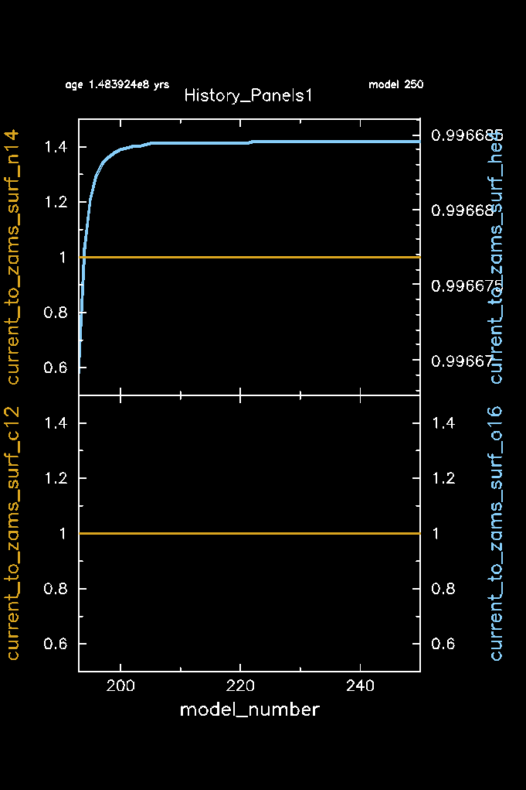

# Introduction 

While convective boundary mixing effectively enhances the convective core, additional mixing processes taking place in the envelope of the star such as rotational mixing can likewise bring renewed fuel to the stellar core. Unlike the CBM, as you will have seen in minilab 1, the envelope mixing can also influence the surface abundances of the star provided that it is sufficiently efficient. More specifically, the surface abundance of nitrogen and helium will increase as excess nitrogen produced by the CNO cycle and helium ashes are transported from the core to the surface, while the surface abundances of carbon and oxygen will decrease. These surface abundances therefore also serve as tracers of internal mixing. One way to study this is to plot the surface abundances as a function of the rotation rate of the star in a so called Hunter diagram. One such diagram is shown below for a sample of B-type stars in the LMC.

     
    
 A Hunter diagram showing the surface nitrogen abundance as a function of $v \sin i$ of a sample of B-type stars in the LMC. The black dashed line shows the predicted trend from population synthesis studies. Reproduced from 
    <a href="https://ui.adsabs.harvard.edu/abs/2011A%26A...530A.116B/abstract" target="_blank" >Brott et al. (2011)</a>. 

In the case of rotational mixing, the diffusive mixing coeffient for the envelope mixing $D_{\rm env}(r)$ is expected to increase for increasing rotation rates. As seen in the figure above, however, there is a sample of the B-type stars showing a surface nitrogen excess while having low projected surface rotation rates (hatched region). One possible explanation is that rather than rotational mixing, mixing from internal gravity waves (IGWs) generated by the convective core is very efficient here. [Rogers & McElwaine (2017)](https://ui.adsabs.harvard.edu/abs/2017ApJ...848L...1R/abstract) demonstrated that IGWs are not only efficient at transporting angular momentum but also gives rise to an efficient mixing mechanism which takes the general form of

\begin{equation}
    D_{\rm env} (r) = D_{\rm env, 0} \left[\frac{\rho (r)}{\rho_{0}} \right]^{-n},
\end{equation}

where $D_{\rm env, 0}$ is the mixing coeffient at the transition from CBM to envelope mixing, $\rho_{0}$ is the corresponding density at this position, $\rho (r)$ is the density, and $n$ is a free parameter with typical values between $\frac{1}{2}$ and $1$. 

     
    
 2D hydrodynamical simulation of the generation of internal gravity waves at a convective boundary (left), and a schematic of a resulting envelope mixing profile from internal gravity waves generated by the convective core (right). Credit: Tamara Rogers (left) & May G. Pedersen (right). 

This type of mixing is not included as one of the options in `MESA`, but there are neat ways that we can include it through `run_star_estras.f90` using one of the `other` hooks without having to make changes to the `MESA` source code. In this maxilab we will do just that and explore how varying the parameters $D_{\rm env, 0}$ and $n$ change not only the period spacing patterns but also the surface abundances of our $4\,{\rm M}_\odot$ SPB star.

# Aims 

**MESA:** In this `MESA` lab you will learn how to implement your own mixing profile in `MESA` using the `other_D_mix` hook in `run_star_extras.f90`, as well as how to add additional output to your `history.data` file that is not available as a default option in `history_columns.list`.

**Science aims:** In this Maxilab, you will learn how different shapes on the envelope mixing profiles from internal gravity waves impacts both the period spacing patterns on SPB stars and their surface abundances.

# Maxilab 

**Warning!** These `MESA` labs have been put together with both low time and spatial resolution for the sake of having the models be completed within a sensible timeframe for the summer school. Before any of these steps or result can be used in any type of actual science case, carrying out a convergence study is crucial!
 

**Minilab 2 solution:** [download](https://raw.githubusercontent.com/MichielsenM/mesa-summer-school-2023/main/solutions/SPB_minilab2_solutions.zip) 
**Maxilab solution:** [download](https://raw.githubusercontent.com/MichielsenM/mesa-summer-school-2023/main/solutions/SPB_maxilab_solutions.zip)

For this Maxilab we will now start digging into our <code>run_star_extras.f90</code> file and make changes both to the <code>MESA</code> output as well as change the mixing profile used in the radiative envelope. Once again, we will start by copying and renaming our Minilab 2 work directory. If you were unable to complete Minilab 2, then you can download the solution from [here](https://raw.githubusercontent.com/MichielsenM/mesa-summer-school-2023/main/solutions/SPB_minilab2_solutions.zip).

 Terminal commands 
 

cp -r SPB_minilab_2 SPB_maxilab 
cd SPB_maxilab  
./clean && ./mk

Also, delete the current contents of your `LOGS` directory to avoid confusion with previous models from minilab 2.

If you worked on the bonus exercises in minilab 2, change both your <code>inlist_project</code> and <code>inlist_pgstar</code> files to make sure that <code>mesh_delta_coeff = 1.0</code>, <code>time_delta_coeff = 1.0</code>, and that the associated <code>Profile_Panels1_file_prefix</code>, 

<code>filename_for_profile_when_terminate</code>, and <code>log_directory</code> parameters are changed accordingly. 

Now if you have a look at your <code>run_star_extras.f90</code> file inside <code>src</code> you should see that it is fairly empty

 src/run_star_extras.f90 
 

<pre class="pre-filetext">
! ***********************************************************************
!
!   Copyright (C) 2010-2019  Bill Paxton & The MESA Team
!
!   this file is part of mesa.
!
!   mesa is free software; you can redistribute it and/or modify
!   it under the terms of the gnu general library public license as published
!   by the free software foundation; either version 2 of the license, or
!   (at your option) any later version.
!
!   mesa is distributed in the hope that it will be useful, 
!   but without any warranty; without even the implied warranty of
!   merchantability or fitness for a particular purpose.  see the
!   gnu library general public license for more details.
!
!   you should have received a copy of the gnu library general public license
!   along with this software; if not, write to the free software
!   foundation, inc., 59 temple place, suite 330, boston, ma 02111-1307 usa
!
! ***********************************************************************
 
      module run_star_extras

      use star_lib
      use star_def
      use const_def
      use math_lib
      
      implicit none
      
      ! these routines are called by the standard run_star check_model
      contains
      
      include 'standard_run_star_extras.inc'

      end module run_star_extras
</pre>

All it is really doing right now is reading the contents of the <code>standard_run_star_extras.inc</code> file located in the <code>$MESA_DIR/star/job</code> directory. When we want to make changes to the <code>run_star_extras.f90</code> setup, the first step is to copy the contents <code>standard_run_star_extras.inc</code> into our <code>run_star_extras.f90</code> file rather than modifying <code>standard_run_star_extras.inc</code>.  

<task>

Task 1

Replace the line <code>include 'standard_run_star_extras.inc'</code> in <code>run_star_extras.f90</code> with the contents of <code>$MESA_DIR/star/job/standard_run_star_extras.inc</code>. Then do a <code>./clean</code> and <code>./mk</code> in your working directory (not in the <code>src</code> directory) to check that everything is working as it should.

</task>

If in doubt, your new <code>run_star_extras.f90</code> should look like <a href="https://github.com/MichielsenM/mesa-summer-school-2023/tree/main/solutions/run_star_extras.f90" target="_blank"> this</a>. 

Whenever we make changes to <code>run_star_extras.f90</code>, we have to use <code>./mk</code> to make sure that the new changes are included in our <code>MESA</code> runs. Doing this often will make it easier to identify the source of any errors associated with our changes to <code>run_star_extras.f90</code> that might pop up when we try to recompile our <code>MESA</code> work directory.

When we want to make changes to different physical or numerical aspects of <code>MESA</code>, the various <code>other hooks</code> located in <code>$MESA_DIR/star/other</code> directory makes it easy to do so inside <code>run_star_extras.f90</code> without having to directly make changes to the <code>MESA</code> source code. It also allows us to do so, without having to apply such changes to all future <code>MESA</code> projects that we do using our installed <code>MESA</code> version. Instructions on how to use these <code>other hooks</code> are given in the <code>$MESA_DIR/star/other/README</code> file. Here we will walk you through how to make changes to the internal diffusive mixing profile using the <code>other_d_mix.f90</code> hook. Let's start by having a look at what this file looks like.

 $MESA_DIR/star/other/other_d_mix.f90 
 

<pre class="pre-filetext">
      module other_D_mix

      ! consult star/other/README for general usage instructions
      ! control name: use_other_D_mix = .true.
      ! procedure pointer: s% other_D_mix => my_routine

      use star_def

      implicit none
      
      contains
      
      
      subroutine null_other_D_mix(id, ierr)
         integer, intent(in) :: id
         integer, intent(out) :: ierr
         ierr = 0
      end subroutine null_other_D_mix

      end module other_D_mix
</pre>

As you can see, the <code>other_d_mix.f90</code> file itself contains some information on what we need to do to include the <code>other_d_mix</code> hook in our <code>MESA</code> runs, but it doesn't actually tell us which parameter we need to modify using the other hook to change the mixing profile. We will get back to this parameter later and focus now on including the <code>other_d_mix</code> hook. 

<task>

Task 2

Copy the subroutine <code>null_other_D_mix</code> from <code>other_d_mix.f90</code> and place it right after the line <code>end subroutine extras_controls</code> in your <code>run_star_extras.f90</code>. Rename the <code>null_other_D_mix</code> subroutine to <code>IGW_D_mix</code>. Do <code>./mk</code> to make sure you didn't make any mistakes.

</task>

Next we need to tell <code>MESA</code> to use our new subroutine <code>IGW_D_mix</code>. 

<task>

Task 3

In <code>inlist_project</code> add the line  <code>use_other_D_mix = .true.</code> under the <code>&controls</code> section. In <code>run_star_extras.f90</code> add the line <code>s% other_D_mix => IGW_D_mix</code> at the end of the <code>extras_controls</code> subroutine. Then compile (<code>./mk</code>) and run (<code>./rn</code>) <code>MESA</code>. Does anything happen to your mixing <code>pgstar</code> window?

</task>
 

Currently, nothing new is actually happening to the mixing profile in <code>MESA</code> because we haven't asked <code>MESA</code> to change it yet. This makes it difficult to tell if <code>MESA</code> is actually calling our new subroutine <code>IGW_D_mix</code>. To check this, we can add a print statement to <code>IGW_D_mix</code>.  

<task>

Task 4

Add the line <code>write(*,*) 'I am using IGW_D_mix'</code> to your <code>IGW_D_mix</code> subroutine inside <code>run_star_extras.f90</code>. Recompile and run <code>MESA</code>, then check the terminal output to see if the line <code>'I am using IGW_D_mix'</code> starts to show up.

</task>
 

Now that we know that <code>MESA</code> is actually calling our <code>IGW_D_mix</code> subroutine, we need to figure out which parameter we have to modify to change the mixing profile. Figuring this out is not always straightforward if we only go by the information available inside the <code>other hooks</code>, and may require some digging into the <code>MESA</code> setup. The name of the subroutine <code>null_other_D_mix</code> inside <code>other_d_mix.f90</code> does give us the hint that it might be called <code>D_mix</code>. Let's try to see if this is a parameter that actually exists in <code>MESA</code>. Note that to get back to the previous directory that you were in, you can use the command `cd -` in the terminal.

 Terminal commands 
 

cd $MESA_DIR  
grep -rI D_mix star/private

When typing in these commands, you should eventually see the following output 

 Terminal output 
 

<pre class="pre-terminal">
...
star/private/mix_info.f90:  s% D_mix(k) = 0d0
star/private/mix_info.f90:  s% D_mix(k) = s% conv_vel(k)*s% mixing_length_alpha*s% Hp_face(k)/3d0
star/private/mix_info.f90:  s% cdc(k) = cdc_factor(k)*s% D_mix(k)
star/private/mix_info.f90:  s% D_mix(k) = s% mlt_D(k)
star/private/mix_info.f90:  if (s% set_min_D_mix .and. s% ye(nz) >= s% min_center_Ye_for_min_D_mix) then
star/private/mix_info.f90:  if (s% D_mix(k) >= s% min_D_mix) cycle
star/private/mix_info.f90:  if (s% m(k) > s% mass_upper_limit_for_min_D_mix*Msun) cycle
star/private/mix_info.f90:  if (s% m(k) < s% mass_lower_limit_for_min_D_mix*Msun) cycle
star/private/mix_info.f90:  s% D_mix(k) = s% min_D_mix
...
</pre>

As seen in the output above, there is indeed a parameter in <code>MESA</code> called <code>D_mix</code> that we should be able to access using the <code>star_info</code> pointer <code>s%</code>. Remember that you can look up the variables contained in the `star_info` structure by searching the files contained in `$MESA_DIR/star_data/public`. For quantities that vary throughout the star, the corresponding variable in the <code>star_info</code> structure is an array where each element corresponds to a zone in the star. You can think of each zone as being a shell around a given radius in the star. So for example <code>s% T(100)</code> would give the temperature of the 100th zone, whereas <code>s% r(100)</code> would give the radius of the 100th zone. The total number of zones of the star is stored in the variable <code>s% nz</code>. <code>MESA</code> stores the zones are stored from surface to center, so in the case of <code>D_mix</code>, <code>s% D_mix(1)</code> is the surface value of <code>D_mix</code> and <code>s% D_mix(s% nz)<code> is the center value.

Let's try to use this in our <code>IGW_D_mix</code> subroutine and change the diffusive mixing coefficient to be some fixed value throughout the star. We declare the variable <code>s</code> using the line <code>type (star_info), pointer :: s</code>. To access the data stored in the <code>star_info</code> structure during a run we have to include the line <code>call star_ptr(id, s, ierr)</code>.  We want to set <code>s% D_mix</code> for every part of the star. We can do this by using a do to iterate over an integer <code>k</code>, which we have to declare at the beginning of the subroutine.

Putting everything together your <code>IGW_D_mix</code> subroutine should look something like this:

 run_star_extras.f90 
 

<pre class="pre-filetext">
      subroutine IGW_D_mix(id, ierr)
         integer, intent(in) :: id
         integer, intent(out) :: ierr
         type (star_info), pointer :: s
         integer :: k
         ierr = 0
         call star_ptr(id, s, ierr)
         if (ierr /= 0) return

         write(*,*) 'I am using IGW_D_mix'
         
         do k=1, s% nz
            s% D_mix(k) = 
         end do

      end subroutine IGW_D_mix
</pre>

<task>

Task 5

Implement the changes to your <code>IGW_D_mix</code> subroutine listed above and set the diffusive mixing coefficient <code>D_mix</code> to be 104 throughout the star. Recompile and run <code>MESA</code>. What happens to your <code>pgstar</code> mixing window?

</task>
 

At this stage, your `pgstar` mixing window should look like this:

     

 

Currently, it looks like the diffusive mixing coefficient is only being changed inside the convective core and the overshooting region, and is now constant in both regions. Let's double-check if anything is happening to the profile in the radiative envelope. 

<task>

Task 6

If you haven't done so already in bonus exercise 1 of Minilab 2, then copy <code>profile_columns.list</code> from <code>$MESA_DIR/star/defaults/</code> to your <code>SPB_maxilab</code> work directory. This file works like the <code>history_columns.list</code> that we modified in Minilab 1. Make sure that <code>brunt_N2</code>,   <code>brunt_N2_structure_term</code>, <code>brunt_N2_composition_term</code>, and <code>log_D_mix</code> are included as output. Then add the following to <code>inlist_pgstar</code>: 

<code>Profile_Panels1_win_flag = .true.</code>  
<code>Profile_Panels1_num_panels = 3</code> 
<code>Profile_Panels1_win_width = 6</code> 
<code>Profile_Panels1_win_aspect_ratio = 1.8</code> 
<code>Profile_Panels1_ytop = 0.95</code> 
<code>Profile_Panels1_ybot = 0.1</code> 
<code>Profile_Panels1_xright = 0.8</code> 
<code>Profile_Panels1_xleft = 0.2</code> 
 
<code>Profile_Panels1_yaxis_name(1) = 'brunt_N2'</code> 
<code>Profile_Panels1_other_yaxis_name(1) = ''</code> 
<code>Profile_Panels1_yaxis_name(2) = 'brunt_N2_structure_term'</code>  <code>Profile_Panels1_other_yaxis_name(2) = 'brunt_N2_composition_term'</code>  
<code>Profile_Panels1_yaxis_name(3) = 'log_D_mix'</code>  <code>Profile_Panels1_other_yaxis_name(3) = ''</code>  <code>Profile_Panels1_file_flag = .true.</code>  <code>Profile_Panels1_file_dir = 'png'</code> 
<code>Profile_Panels1_file_prefix = 'profile_panels1_1.0mdc_1.0tdc_'</code> 
<code>Profile_Panels1_file_width = 12</code> 
<code>Profile_Panels1_file_aspect_ratio = 0.75</code>

</task>
 

As a reminder you can adjust <code>Profile_Panels1_win_width</code> and <code>Profile_Panels1_win_aspect_ratios</code> to change the size of the plot on your screen. Your `Profile_Panels1` `pgstar` window should look something like this:

     

 

When you now run <code>MESA</code>, you should see that although nothing seems to be happening in the envelope according to the <code>pgstar</code> mixing window, then the mixing profile is indeed constant throughout the star. In other words, <code>MESA</code> is doing what we are telling it to do. This is because our ''new'' mixing profile has not been assigned a mixing type. For an overview of what different types are available, have a look at <code>$MESA_DIR/const/public/const_def.f90</code>.

 $MESA_DIR/const/public/const_def.f90 
 

<pre class="pre-filetext">
...
! mixing types
! NOTE: some packages may depend on the order
integer, parameter :: crystallized = -1
integer, parameter :: no_mixing = 0
integer, parameter :: convective_mixing = 1
integer, parameter :: overshoot_mixing = 2
integer, parameter :: semiconvective_mixing = 3
integer, parameter :: thermohaline_mixing = 4
integer, parameter :: rotation_mixing = 5
integer, parameter :: rayleigh_taylor_mixing = 6
integer, parameter :: minimum_mixing = 7
integer, parameter :: anonymous_mixing = 8  ! AKA "WTF_mixing"
integer, parameter :: leftover_convective_mixing = 9  
...
</pre>

All of these integer values for the different mixing types are contained within the <code>s% mixing_type(:)</code> parameter. In other words, a region where <code>s% mixing_type(k) = 1</code> has convective mixing. For now, let's set the envelope mixing to correspond to the minimum mixing, i.e. <code>s% mixing_type(k) = 7</code>. To do so, we first have to activate the minimum mixing in <code>MESA</code>. 

<task>

Task 7

In <code>inlist_project</code> set the parameter <code>set_min_D_mix = .true.</code> and tell <code>MESA</code> to use 0.1 as the minimum diffusive mixing coefficient. Make sure that <code>mixing_type</code> is included as a profile output, and include it in <code>inlist_pgstar</code> as <code>Profile_Panels1_other_yaxis_name(3)</code>. Then run <code>MESA</code>.

</task>

<hint>

 Hint 

The parameter used to set the minimum mixing value is called <code>min_D_mix</code>.

</hint>
 

You should now see the envelope mixing, i.e. minimum mixing, appears as an orange line in your <code>pgstar</code> mixing window. 

     

 

If in doubt, your inlist should look something like <a href="https://github.com/MichielsenM/mesa-summer-school-2023/blob/main/solutions/Maxilab_intermediate_solutions/inlist_task7" target="_blank"> this</a>, your inlist_pgstar should look like <a href="https://github.com/MichielsenM/mesa-summer-school-2023/blob/main/solutions/Maxilab_intermediate_solutions/inlist_pgstar_task7" target="_blank"> this</a>, and the subroutine <code>IGW_D_mix</code> should look like <a href="https://github.com/MichielsenM/mesa-summer-school-2023/blob/main/solutions/Maxilab_intermediate_solutions/IGW_D_mix_task7.f90" target="_blank"> this</a>. If you've gotten stuck feel free to copy and paste these intermediate solutions. 

So far we have been completely overwriting the mixing profile throughout the star to a constant value, even inside the convective regions. So even though we are telling <code>MESA</code> to do something silly, it is still running and trying to find a solution! What we want to do is only change the mixing profile in the radiative envelope, i.e. avoid regions where we have convective mixing and overshoot mixing. We can do this using an `if` statement  

In `Fortran`, <code>if</code> statements are written in the format

 if statements 
 

<pre class="pre-filetext">
if ((one condition) .and. (another condition)) then
    Do something
endif
</pre>

You can also use such <code>if</code> statements to exit a <code>do</code>-loop once a condition has been met

 if condition then do something and exit do-loop 
 

<pre class="pre-filetext">
do k=1, s% nz
    if (a condition) then
        Do something
        exit
    endif
end do
</pre>

<code>Fortran</code> has three logical operators: <code>.and.</code>, <code>.or.</code>, and <code>.not.</code>  

Additional useful comparison operators are given in the table below.

 <table>
  <tr>
    <th> Condition </th>
    <th> <code>Fortran</code> text form </th>
    <th> <code>Fortran</code> symbol form </th>
  </tr>
  <tr>
    <td> equal to </td>
    <td> <code> .eq. </code> </td>
    <td> <code> == </code> </td>
  </tr>
  <tr>
    <td>not equal to </td>
    <td> <code> .ne. </code> </td>
    <td> <code> /= </code> </td>
  </tr>    
  <tr>
    <td> greater than </td>
    <td> <code>.gt.</code> </td>
    <td> <code> > </code>  </td>
  </tr>
  <tr>
    <td> less than </td>
    <td> <code>.lt.</code> </td>
    <td> <code> < </code> </td>
  </tr>
  <tr>
    <td> greater than or equal to </td>
    <td> <code>.ge.</code> </td>
    <td> <code> >= </code>  </td>
  </tr>
  <tr>
    <td> less than or equal to </td>
    <td> <code>.le.</code> </td>
    <td> <code> <= </code> </td>
  </tr>  
</table>

Knowing these will be useful in the following steps as well and whenever you want to add things to your <code>run_star_extras.f90</code> in general. 

<task>

Task 8

Modify your <code>IGW_D_mix</code> subroutine to only change the mixing profile when no convective or diffusive overshoot mixing is happening. You can do so using an <code>if</code> statement inside your <code>do</code> loop.

</task>
 
<hint>

 Hint 

    Rember you can use <code>s% mixing_type(k)</code> to determine if/what type of mixing is occurring. A value of 1 corresponds to convective mixing, and a value of 2 corresponds to overshoot mixing. So to apply changes to the envelope of the star we need to check that <code>s% mixing_type(k)</code> doesn't equal <code>1</code> or <code>2</code>. 

</hint>

Notice that right now there is a discontinuity in our mixing profile when we go from overshoot to minimum mixing. 

     

 

This discontinuity around is a problem.  

Before we deal with this, feel free to pause, stretch a bit, and drink some water if you need to. The next two tasks are tricky so check in with your energy levels and remaining time to decide what difficulty level feels right for you: 
<strong>I’m up for a challenge:</strong> try to implement the procedure described in the text without looking at the task or the hint  
<strong>Just get me started:</strong> The task gives a suggested series of steps  
<strong>Walk me through it:</strong> The hint details how to implement each suggested step  
<strong>Show me how its done:</strong> Jump directly to the solutions below  

We want to get rid of this discontinuity by modifying our <code>IGW_D_mix</code> subroutine to automatically change the diffusive mixing coefficient to 104 when the original diffusive mixing profile drops below this value, which we'll call $D_{\rm env, 0}$. To accomplish this, we need to find the first zone number, which we'll call `k0`,r where `D_mix` is less than or equal to $10^4$ when going from the core to the surface of the stellar model. A reminder that this is backward of how `MESA` indexes arrays, where 1 is the surface and `s% nz` is the center. We also want to make sure that we aren't overwriting any subsurface convection zones that might show up, so we will only modify `s% D_mix` in regions with no convection. 

Additionally, it would also be nice to be able to change this value, $D_{\rm env, 0}$, from the inlist, rather than having it hard coded in run_star_extras (which requires us to re-compile MESA every time we make a change). 

<task>

Task 9

To modify the <code>IGW_D_mix</code> subroutine in <code>run_star_extras.f90</code> follow these steps:  
1. Declare the <code>D_env_0</code> parameter  
2. Parameterize the <code>D_env_0</code> using <code>x_ctrl(1)</code>  
3. Declare the <code>k0</code> parameter   
4. Identify the value of <code>k0</code>  
5. Iterate from the surface of the star to <code>k0</code> and change <code>s% D_mix(k)</code> the mixing profile only when there is no convection occuring 

With these modifications, your subroutine will automatically adjust the diffusive mixing coefficient when the original profile dips below the threshold, removing any discontinuity.

</task>

<hint>

 Hint 

To modify the <code>IGW_D_mix</code> subroutine in <code>run_star_extras.f90</code> to ensure the discontinuity is removed, follow these steps:  

<strong>Define the <code>D_env_0</code> parameter:</strong> Within the <code>IGW_D_mix</code> subroutine, declare a new real double precision <code>real(dp)</code> parameter named <code>D_env_0</code>. This corresponds to the $D_{\rm env, 0}$ in the equation above. Note that for our current setup, we simply have $D_{\rm env} (r) = D_{\rm env, 0} = 10^4$, corresponding to a constant envelope mixing at $10^4$.  

<strong>Parameterize the discontinuity value:</strong> Instead of hardcoding the value of <code>D_env_0</code> to be 104, use the <code>x_ctrl</code> control parameter. Under the <code>&controls</code> section in <code>inlist_project</code>, set <code>x_ctrl(1)</code> to <code>1d4</code>. This allows the value to be altered without needing to modify the <code>run_star_extras.f90</code> file directly. You can then use this value in your subroutine by referencing <code>s% x_ctrl(1)</code>. Do so by setting <code>D_env_0 = s% x_ctrl(1)</code> before your <code>do</code>-loops in your <code>IGW_D_mix</code> subroutine.  

<strong>Define the <code>k0</code> parameter:</strong> Within the <code>IGW_D_mix</code> subroutine, declare a new integer parameter named <code>k0</code>. This will represent the first cell where <code>D_mix</code> is less than 104 as you progress from the core to the surface.  

<strong>Identify the value of <code>k0</code>:</strong> Before the existing loop, implement a new loop that iterates from <code>1</code> to <code>s% nz</code>. Within this loop, check if the value of <code>D_mix</code> at position <code>(s% nz - k)</code> is less than <code>D_env_0</code>. If true, set <code>k0</code> to <code>s% nz - k</code> and exit the loop.  

<strong>Iterate from the surface of the star to <code>k0</code> and change <code>s% D_mix(k)</code> the mixing profile only when there is no convection occurring:</strong> Adjust your existing loop to iterate from <code>1</code> to <code>k0</code>. Within this loop, ensure that if the mixing type isn't convective using an <code>if</code> statement with the following condition: <code>s% mixing_type(k) != 1</code> and then update the <code>D_mix</code> to <code>D_env_0</code> and set the <code>mixing_type</code> to <code>7</code>.  

With these modifications, your subroutine will automatically adjust the diffusive mixing coefficient when the original profile dips below the threshold, removing any discontinuity.

</hint>
 

Once you have made the above changes then run <code>MESA</code>. The current version of your <code>IGW_D_mix</code> subroutine should look something like this

 run_star_extras.f90 
 

<pre class="pre-filetext">
subroutine IGW_D_mix(id, ierr)
    integer, intent(in) :: id
    integer, intent(out) :: ierr
    type (star_info), pointer :: s
    integer :: k, k0
    real(dp) :: D_env_0
    ierr = 0
    call star_ptr(id, s, ierr)
    if (ierr /= 0) return
         
    write(*,*) 'I am using IGW_D_mix'

    ! Set the value of D_env_0 according to s% x_ctrl(1)
    D_env_0 = s% x_ctrl(1)
         
    ! Find k0
    do k=1, s% nz
      if (s% D_mix(s% nz - k) .lt. D_env_0) then
        k0 = s% nz - k
        exit
      end if
    end do
         
    ! Change mixing profile in the envelope, avoiding convective zones
    do k=1, k0
      if (s% mixing_type(k) .ne. 1) then
        s% D_mix(k) = D_env_0
        s% mixing_type(k) = 7
      endif
    end do
         
end subroutine IGW_D_mix
</pre>

 

The corresponding `pgstar` mixing window should look like this:

     

 

With the current version of our <code>IGW_D_mix</code> subroutine we could achieve the exact same result by just varying the parameter <code>min_D_mix</code> inside <code>inlist_project</code>. Now as a final step, we are going to change the envelope mixing profile to be a function of the density profile using 

\begin{equation}
    D_{\rm env} (r) = D_{\rm env, 0} \left[\frac{\rho (r)}{\rho_{0}} \right]^{-n}.
\end{equation}

In this equation, $D_{\rm env, 0}$ corresponds to the diffusion coefficient at the bottom of the stellar envelope, which we’ve already defined using `x_ctrl(1)` in the previous step. For this step, we’ll use a value of $D_{\rm env, 0} = 100$.  $n$ is another free parameter that we want to be able to set in our `inlist_project`, we can do this using the variable `x_ctrl(2)`. Let’s use $n=0.5$ for now. $\rho(r)$ is the density at the radius $r$ , and $\rho_0$ is the density at `k0`. This new mixing profile applies in the same region as our previous tasks, so we can still use our existing 
`do` loop and `if` statement.

<task>

Task 10

To implement this mixing profile we need to make several more modifications to our <code>IGW_D_mix</code> subroutine.  
1. Declare the variable <code>n</code>  
2. Set <code>n</code> using <code>x_ctrl(2)</code> to <code>0.5</code>  and change <code>x_ctrl(1)</code> to 100
3. Set <code>D_env_0</code> = 100  
4. Find the variable in <code>star_info</code> that stores density: (see <code>$MESA_DIR/star/public/star_data/star_data_step_work.inc</code>)  
5. Declare a new variable <code>rho0</code> and set it in the loop that finds <code>k0</code> 
6. Implement the new mixing profile  
NOTE: while you can use the Fortran <code>**</code> operator to raise something to a power, it is better to use the built-in function <code>pow(value, exponent)</code>. You can find all the math functions built-in to <code>MESA</code> in <code>$MESA_DIR/math/public/math_lib_crmath.f90</code>  
7. Compile and run

</task>

<hint>

 Hint 

To implement this mixing profile we need to make several more modifications to our <code>IGW_D_mix</code> subroutine.  

<strong>Declare the variable <code>n</code>: </strong> Within the <code>IGW_D_mix</code> subroutine, declare a new real double precision variable <code>real(dp)</code> named <code>n</code>.   
<strong>Set <code>n</code> using <code>x_ctrl(2)</code>:</strong> In <code>inlist_project</code>, set <code>x_ctrl(2)</code> to <code>0.5</code>, also set <code>x_ctrl(1) to 100</code>. In the <code>IGW_D_mix</code> subroutine set <code>n = s% x_ctrl(2)</code> after the line that sets <code>D_env_0</code>  
<strong>Find the variable that stores density: </strong>Search <code>$MESA_DIR/star/public/star_data/star_data_step_work.inc</code> for 'density' to find the variable name that stores the density.  
<strong>Declare a new variable <code>rho0</code> and set it in the loop that finds <code>k0</code>:</strong> Declare a new real  double precision variable <code>real(dp)</code> named <code>rho0</code> at the begining of <code>IGW_D_mix</code>. After the line that sets <code>k0 = s% nz - k</code> set <code>rho0 = s% Rho(k0)</code> 
<strong>Implement the new mixing profile: </strong> Change the line that sets <code>s% D_mix(k)</code>to <code>s% D_mix(k) = D_env_0*pow((s% rho(k) / rho0),-1*n)</code>.  
NOTE: while you can use the Fortran <code>**</code> operator to raise something to a power, it is better to use the built-in function <code>pow(value, exponent)</code>. You can find all the math functions built-in to <code>MESA</code> in <code>$MESA_DIR/math/public/math_lib_crmath.f90</code>   
<strong>Compile and run</strong> Do <code>./mk</code> and <code>./rn</code> and see what has changed with our new mixing scheme   

</hint>

At this point, your `IGW_D_mix subroutine should look like this: 

 run_star_extras.f90 
 

<pre class="pre-filetext">

      subroutine IGW_D_mix(id, ierr)
         integer, intent(in) :: id
         integer, intent(out) :: ierr
         type (star_info), pointer ::s
         integer :: k,k0
         real(dp) :: D_env_0, n, rho0
         ierr = 0

         call star_ptr(id, s, ierr)
         if (ierr /= 0) return

         write(*,*) 'I am using IGW_D_mix'

        ! Set D_env_0 and n outside of the loop since they don't change 
         D_env_0 = s% x_ctrl(1)
         n = s% x_ctrl(2)

         ! Find k0, the index of the first cell where D_mix <  D_env_ 0     
         do k=1, s%nz
            if (s% D_mix(s%nz - k) .lt. D_env_0)  then
               k0 = s%nz -k
               rho0 = s% Rho(k0)
               exit
            endif
         end do

         do k=1, k0
            !If mixing is not convective then change D_mix&mixing_type
            if (s% mixing_type(k) .ne. 1) then
               s% D_mix(k) = D_env_0*pow((s% rho(k) / rho0),-1*n)
               s% mixing_type(k) = 7
            end if
         end do

      end subroutine IGW_D_mix

</pre>

 

And your `pg_star` mixing window should look like this: 

     

 

Now that we have the internal mixing profile setup, the final step is making sure that we have all of the output that we need for comparisons. We already have our setup for computing the <code>GYRE</code> models from minilab 2 to look at the impact on the period spacing patterns. In addition to this, we want to look at the impact on the surface abundances of 4He, 12C, 14N, and 16O. More specifically, we want to look at how different they are from their values at the ZAMS. We could just do this by looking at our standard history output and modify our <code>history_columns_list</code> file, but we can make things a bit easier for ourselves by including these as extra history output in <code>run_star_extras.f90</code>. The values that we want to look at are of the format

\begin{equation}
    \text{current to ZAMS }^4\text{He} = \frac{\text{current surface}\ ^4\text{He}}{\text{surface}\ ^4\text{He at ZAMS}}.
\end{equation}

 
To do this, we are going to modify four separate parts of the <code>run_star_extras.f90</code> file: 

<ul>
    <li> Add parameters at the very beginning of <code>run_star_extras.f90</code> </li>
    <li> Set these parameter values in the subroutine <code>extras_startup</code> </li>
    <li> Tell <code>MESA</code> the number of extra history output columns to include in the function <code>how_many_extra_history_columns</code> </li>
    <li> Name and assign the extra history output data in the subroutine <code>data_for_extra_history_columns</code>. </li>
</ul>

Let's start by using 4He as an example. We want to save the initial ZAMS value of 4He at the surface of the star so it does not get overwritten at each time step when we run <code>MESA</code>. We will call this parameter <code>initial_surface_he4</code> and define it at the top of our <code>run_star_extras.f90</code> file right after the line <code>implicit none</code>. We want to declare this parameter as a real number with double precision.

 

 run_star_extras.f90 
 

<pre class="pre-filetext">
...

module run_star_extras

use star_lib
use star_def
use const_def
use math_lib
      
      
implicit none

real(dp) :: initial_surface_he4
      
! these routines are called by the standard run_star check_model
contains

...
</pre>

 

In this way, <code>run_star_extras.f90</code> will recognise this parameter everywhere without us having to declare it again. Currently, we haven't given this new parameter <code>initial_surface_he4</code> a value. To do so, we want to get the initial surface 4He value before <code>MESA</code> starts taking any time steps. We can do so in the subroutine <code>extras_startup</code>

 

 run_star_extras.f90 
 

<pre class="pre-filetext">
subroutine extras_startup(id, restart, ierr)
    integer, intent(in) :: id
    logical, intent(in) :: restart
    integer, intent(out) :: ierr
    type (star_info), pointer :: s
    ierr = 0
    call star_ptr(id, s, ierr)
    if (ierr /= 0) return

    initial_surface_he4 = s% surface_he4
                  
end subroutine extras_startup
</pre>

 

Note that while the parameter for the surface 4He mass fraction is called <code>surface he4</code> in your <code>history_columns.list</code> file, it is called <code>surface_he4</code> internally in <code>MESA</code>.

Now that we have saved the initial surface 4He mass fraction, our next steps are to tell <code>MESA</code> how many extra history output columns we want to add to our <code>history.data</code> output file. We do so inside the function <code>how_many_extra_history_columns</code> by modifying the parameter by the same name.

 

 run_star_extras.f90 
 

<pre class="pre-filetext">
integer function how_many_extra_history_columns(id)
    integer, intent(in) :: id
    integer :: ierr
    type (star_info), pointer :: s
    ierr = 0
    call star_ptr(id, s, ierr)
    if (ierr /= 0) return
    how_many_extra_history_columns = 1
end function how_many_extra_history_columns
</pre>

 

Note that if you compile and run <code>MESA</code> now before assigning the extra history column a name and value, then you will start to receive a warning in the terminal but it won't stop <code>MESA</code> from running. 

 

 Terminal output 
 

Warning empty history name for extra_history_column            1

 

Now, to give the extra history column a name and a value we need to add the parameters <code>names(n)</code> and <code>vals(n)</code> to the subroutine <code>data_for_extra_history_columns</code>. Here <code>n</code> is the index of the added history column. So if you want to add two extra history columns you need to assign both <code>names(1)</code> and <code>vals(1)</code> as well as <code>names(2)</code> and <code>vals(2)</code>. To calculate the ratio between the current surface 4He mass fraction and the initial ZAMS value, we can now do so by using our two parameters <code>s% surface_he4</code> and <code>initial_surface_he4</code>. We will call this ratio <code>current_to_zams_surf_he4</code>.

 

 run_star_extras.f90 
 

<pre class="pre-filetext">
subroutine data_for_extra_history_columns(id, n, names, vals, ierr)
    integer, intent(in) :: id, n
    character (len=maxlen_history_column_name) :: names(n)
    real(dp) :: vals(n)
    integer, intent(out) :: ierr
    type (star_info), pointer :: s
    ierr = 0
    call star_ptr(id, s, ierr)
    if (ierr /= 0) return
         
    ! note: do NOT add the extras names to history_columns.list
    ! the history_columns.list is only for the built-in history column options.
    ! it must not include the new column names you are adding here.
         
    names(1) = 'current_to_zams_surf_he4'
    vals(1) = s% surface_he4 / initial_surface_he4
         
end subroutine data_for_extra_history_columns
</pre>

 

<task>

Task 11

Following the example above, modify your <code>run_star_extras.f90</code> to include the ratios of the current to initial ZAMS mass fraction of 4He, 12C, 14N, and 16O to your output <code>history.data</code> file. Compile and run <code>MESA</code> to make sure your modifications work.  
Ideally, you should try and implement at least one history column by yourself but if you are stuck or running low on time, feel free to use the completed <code>run_star_extras.f90</code> file <a href="https://github.com/MichielsenM/mesa-summer-school-2023/blob/main/solutions/Maxilab_intermediate_solutions/run_star_extras.f90" target="_blank"> here</a>.

</task>
 

Once you have updated your <code>run_star_extras.f90</code> you can also keep track of how these ratios change throughout the evolution of the star by including a <a href="https://docs.mesastar.org/en/release-r23.05.1/reference/pgstar.html#history-panels" target="_blank">history panels <code>pgstar</code></a> window. 

<task>

Task 12

Add the following to your <code>inlist_pgstar</code> file: 
<code>History_Panels1_win_flag = .true.</code>  
<code>History_Panels1_num_panels = 2</code>  
<code>History_Panels1_yaxis_name(1) = 'current_to_zams_surf_n14'</code>  
<code>History_Panels1_other_yaxis_name(1) = 'current_to_zams_surf_he4'</code>  
<code>History_Panels1_yaxis_name(2) = 'current_to_zams_surf_c12'</code>  
<code>History_Panels1_other_yaxis_name(2) = 'current_to_zams_surf_o16'</code>  

</task>
 

Your final `pgstar` `mixing` and `History_Panels1` windows should look something like this

  

      

        
      

      

        
      

  

Now we have our <code>MESA</code> setup done for the Maxilab and it is time to vary some parameters and investigate the effect of envelope mixing on both the period spacing patterns and the surface abundances. 

<task>

Task 13

In this final task of the Maxilab, there are four parameters in <code>inlist_project</code> that you will have to change/vary: <code>filename_for_profile_when_terminate</code>, <code>log_directory</code>, <code>x_ctrl(1)</code>, and <code>x_ctrl(2)</code>. Additionally, you will need to update the <code>file</code> and <code>sumary_file</code> parameters in your <code>gyre.in</code> file. The steps you have to take are as follows:

<ul>
    <li> Go to the <a href="https://docs.google.com/spreadsheets/d/1KrAoaLLOtSo-p8H_E2XO77FEUni6PugNR7jKK6_I71c/edit#gid=1105905148" target="_blank">Google spreadsheet</a> and claim a $D_{\rm env,0}$ and $n$ value by putting your name down in the left-most column. </li>
    <li> Change <code>log_directory</code> to be of the format <code>'LOGS/4Msun_0.01fov_#Denv0_#n'</code> and also change the parameter <code>filename_for_profile_when_terminate</code> accordingly. </li>
    <li> Set <code>overshoot_f(1) = 0.01</code> </li>
    <li> Set <code>x_ctrl(1)</code> and <code>x_ctrl(2)</code> to your chosen $D_{\rm env,0}$ and $n$. </li>
    <li> Run <code>MESA</code>. </li>
    <li> Check your output <code>history.data</code> file and note down the last recorded value of <code>current_to_zams_surf_he4</code>, <code>current_to_zams_surf_c12</code>, <code>current_to_zams_surf_n14</code>, and <code>current_to_zams_surf_o16</code> in the corresponding columns <code>tams_to_zams_surface_he4</code>, <code>tams_to_zams_surface_c12</code>, <code>tams_to_zams_surface_n14</code>, and <code>tams_to_zams_surface_o16</code> in the Google spreadsheet. </li>
    <li> Update your <code>gyre.in</code> file to point to the correct input file (with the <code>file</code> parameter in the <code>&model</code> section) and to output the correct file name (using <code>summary_file</code> in the <code>&ad_output</code> section). Then run <code>GYRE</code> as in minilab 2: <code>$GYRE_DIR/bin/gyre gyre.in</code>.</li>
    <li> Have your TA plot the corresponding period spacing pattern. </li>
    <li> Congratulate yourself on getting through this lab!</li>
    <li> If you still have time, you can repeat this task with another set of $D_{\rm env,0}$ and $n$ values.</li>
</ul>

</task>

As you are adding your parameters to the Google spreadsheet, keep an eye on how the plots for the different mass fractions are changing. At what value of $D_{\rm env,0}$ do you start to see a change in the surface abundances? How does this depend on the choice of $n$?
