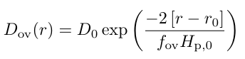

# Minilab 1

In this Minilab 1, we will start constructing the `inlist` we need to study period spacing patterns in SPB stars and investigate the effect of convective boundary mixing on the asymptotic period spacing &Pi;<sub>0</sub>, the convective core mass <i>m</i><sub>cc</sub>, and the helium core mass <i>m</i><sub>He, core</sub> obtained at the terminal-age main-sequence (TAMS). As a first step, when starting a new project with <math>MESA</math>, we copy and rename the `$MESA_DIR/star/work` directory


```
cp -r $MESA_DIR/star/work SPB_minilab_1
cd SPB_minilab_1
```

For good measure, let's make sure that the standard <math>MESA</math> inlist runs
```
./clean & ./mk
./rn
```

Let it run until the <math>pgstar</math> window shows up, then terminate the run using `ctrl + c`. 

If everything is running as it should (if not, ask your TA for help!) then it is now time to start modifying your <math>MESA</math> inlists. We will be using the same inlists throughout Minilab 1, Minilab 2, and the Maxilab and keep adding things to them as we go along. To begin with, we will focus on the <math>inlist_project</math> file. Usually, we want to start the evolution from the pre-main-sequence, however, in an effort to save time for these labs we will instead start the evolution at the zero-age-mains-sequence (ZAMS) and evolve the star until core hydrogen exhaustion. To do this, we have to modify both <math>&star_job</math> and <math>&controls</math>

```
&star_job
  ...

  ! begin with a pre-main sequence model
    create_pre_main_sequence_model = .true.
  ...

/ ! end of star_job namelist

...

&controls
  ...

  ! when to stop

    ! stop when the star nears ZAMS (Lnuc/L > 0.99)
    Lnuc_div_L_zams_limit = 0.99d0
    stop_near_zams = .true.

    ! stop when the center mass fraction of h1 drops below this limit
    xa_central_lower_limit_species(1) = 'h1'
    xa_central_lower_limit(1) = 1d-3

  ...

/ ! end of controls namelist
```


<task><details>
<summary>Task 1</summary><p>
Modify the <math>&star_job</math> and <math>&controls</math> sections of <math>inlist_project</math> to start the evolution at the ZAMS and stop when the core <sup>1</sup>H mass fraction drops below 0.001, then try to evolve the star.
</p></details></task>

<hint><details>
<summary> Hint </summary><p>
The parameters that need to be changed are <code>create_pre_main_sequence_model</code> and <code>stop_near_zams</code>.
</p></details></hint>

Once the main-sequence evolution is running, we will keep modifying inlist_project.

<task><details>
<summary>Task 2</summary><p>
What is the default nuclear network used by <math>MESA</math>? Change this in the <math>&star_job</math> section of <math>inlist_project</math> so <math>pp_cno_extras_o18_ne22.net</math> is used instead. Also include an abundance window to the <math>pgstar</math> output. What happens to the abundance <math>pgstar</math> window when you change the network?
</p></details></task>

<hint><details>
<summary> Hint </summary><p>
The parameters that need to be added in <math>inlist_project</math> are <code>change_net</code> and <code>new_net_name</code>. To plot the abundance window, add <code>Abundance_win_flag = .true.</code> to <math>inlist_pgstar</math>.
</p></details></hint>

#TODO FIX THE REFERENCE
<task><details>
<summary>Task 3</summary><p>
Make the following additional changes to <math>inlist_project</math>. The text in the parenthesis indicate where in the <math>inlist_project</math> file the required changes have to be made.


<ul>
<li> Change the initial mass to 4M<sub>sun</sub> (<math>&controls</math>).  </li>
<li> Change the output LOGS directory to LOGS/4Msun\_0fov (<math>&controls</math>). </li>
<li> Relax the composition to X=0.71, Y=0.276, and Z=0.014 (<math>&star_job</math>, <math>&kap</math>, and <math>&controls</math>). In <math>&controls</math> add the following two parameters: <code>relax_dY = 0.001</code> and <code>relax_dlnZ = 1d-2</code>. </li>
<li> Use the OP opacity tables for the [Asplund2009](https://ui.adsabs.harvard.edu/abs/2009ARA&A..47..481A) metal mixture (<math>&kap</math>). </li>
<li> Likewise, set initial metal mass fraction distribution to the one of [Asplund2009](https://ui.adsabs.harvard.edu/abs/2009ARA&A..47..481A) (<math>&star_job</math>).</li>
<li> Set <math>pgstar</math> to pause before terminating (<math>&star_job</math>). </li>
<li> Output history data at every time step instead of every fifth time step (<math>&controls</math>).</li>
</ul>
</p></details></task>

<hint><details>
<summary> Hint </summary><p>
The parameters that need to be added in <math>&star_job</math> are: <code>&relax_Y</code>, <code>&new_Y</code>, <code>&relax_Z</code>, <code>&new_Z</code>, <code>initial_zfracs</code>, and <code>pause_before_terminate</code>.
</p></details></hint>

<hint><details>
<summary> Hint </summary><p>
The parameters that need to be added in <math>&controls</math> are: <code>log_directory</code>, <code>&relax_dY = 0.001</code>, <code>&relax_dlnZ = 1d-2</code>, and <code>history_interval</code>.
</p></details></hint>

<hint><details>
<summary> Hint </summary><p>
The parameters that need to be changed in <math>&controls</math> are: <math>initial_mass</math> and <math>initial_z</math>. The latter one has to be commented out, or <math>MESA</math> will start complaining.
vscode find and replace
</p></details></hint>

<hint><details>
<summary> Hint </summary><p>
In <math>&kap</math> the parameter <math>kap_file_prefix</math> has to be added while <math>Zbase</math> has to be changed to match the new metal mass fraction.}\\
</p></details></hint>

<hint><details>
<summary> Hint </summary><p>
Concerning figuring out how to set the <math>kap_file_prefix</math> parameter, you might notice if you look up this parameter on the <math>MESA</math> documentation website that the following options are listed: <math>gn93</math>, <math>gs98</math>, <math>a09</math>, <math>OP\_gs98</math>, and <math>OP\_a09\_nans\_removed\_by\_hand</math>. However, no explanation is given as to what these parameters actually stand for. From the naming of the parameters you might be able to guess which one you have to use, but if you want to be sure then one way to do this is to go to your <math>$MESA_DIR/data/kap_data/</math> directory and look at the files there. In the file names, everything before <math>_z#.#_x#.#.data</math> corresponds to the input options for the <math>kap_file_prefix</math> parameter. If you choose one of the files there and open it, then the first line of the file will give you the explanation and reference to the table.
</p></details></hint>

<hint><details>
<summary> Hint </summary><p>
Concerning figuring out how to set the <math>initial_zfracs}</math> parameter, the <math>MESA</math> documentation website will let you know that the eight possible options are defined in the <math>$MESA_DIR/chem/public/chem_def.f90</math> file. If you look from line number 299 and beyond, then you should be able to compare the references to the different metal mixtures.
</p></details></hint>

Once you have implemented the changes above, try to run <math>MESA</math> and see if all the implemented changes work as they should. If you tried to change the two parameters <math>initial_z</math> and <math>initial_y</math> to match the new compositions, you will see that <math>MESA</math> starts to complain and gives you the message:

```
 WARNING: requested initial_z does not match zams file initial_z.
                                    zams file initial_z    2.0000000000000000D-02
                                    requested initial_z    1.4000000000000000D-02


 failed in read_zams_header
File: ../private/init_model.f90, Line:  194, Message: get1_zams_model
ERROR STOP 1

Error termination. Backtrace:
#0  0x13a91e147
#1  0x13a91ecf7
#2  0x13a91ffb3
#3  0x102af7c83
#4  0x102682d5f
#5  0x102683ea7
#6  0x10268f9eb
#7  0x10269088f
#8  0x1026cb017
#9  0x1026de7ff
#10  0x1026e7b03
#11  0x1026e8a9b
#12  0x1026e8c5b
#13  0x102138ff7
#14  0x102139093
#15  0x1021390d3
```


This is because <math>MESA</math> only has initial ZAMS starting models available for <math>initial_z = 0.02</math> and <math>initial_y = 0.28</math> (see <math>$MESA_DIR/data/star_data/zams_models/zams_z2m2_y28.data</math>) and therefore does not known what to do if you try to change these initial compositions. One option is create such starting ZAMS models of different composition, and another is to start from one of these predefined ZAMS models and relax the composition to the one that you want. For this exercise we did the latter of the two options.

Once your new <math>inlist_project</math> is working, the next step is to start including convective boundary mixing. Before doing so, lets adjust the plotting window of the <math>pgstar</math> HR diagram and include one additional <math>pgstar</math> plotting windows showing the mixing profile.


<task><details>
<summary>Task 4</summary><p>
Zoom in on the MS evolutionary track of the start in the <math>pgstar</math> HR window and include an additional <math>pgstar</math> window showing the mixing profile. 
</p></details></task>

<hint><details>
<summary> Hint </summary><p>
Modify the four input parameters <math>HR_logT_min</math>, <math>HR_logT_max</math>, <math>HR_logL_min</math>, and <math>HR_logL_max</math> in <math>inlist_pgstar</math>. You can do this on the fly while <math>MESA</math> is running. Look up "Mixing window" in the <math>MESA</math> <math>pgstar</math> documentation. The parameter you want to add to <math>inlist_pgstar</math> is <math>Mixing_win_flag</math>.
</p></details></hint>

The final input parameters we want to add to <math>inlist_project</math> is convective boundary mixing. For this exercise we will only consider exponential diffusive overshoot on top of the hydrogen burning convective core: 



This type of mixing is one out of two overshoot mixing schemes that have been implemented in <math>MESA</math>. <i>D</i><sub>0</sub> is the diffusive mixing coefficient at <i>r</i><sub>0</sub> = <i>r</i><sub>cc</sub> - <i>f</i><sub>0</sub> <i>H</i><sub>p, cc</sub>, i.e. at a step of <i>f</i><sub>0</sub> <i>H</i><sub>p, cc</sub> inside the convective core boundary at radius coordinate <i>r</i><sub>cc</sub>, <i>H</i><sub>p, 0</sub> is the pressure scale height at <i>r</i><sub>0</sub>, <i>H</i><sub>p, cc</sub> is the pressure scale height at <i>r</i><sub>cc</sub>, and <i>f</i><sub>ov</sub> is the overshoot parameter. For this exercise, we will fix <i>f</i><sub>0</sub> = 0.002 and vary <i>f</i><sub>ov</sub> from 0.005 to 0.04.


<task><details>
<summary>Task 5</summary><p>
Look up the parameters required to include convective boundary mixing (overshoot) in <math>MESA</math>. Include these parameters in <math>inlist_project</math> (<math>&controls</math>), replace the (:) with (1), set the overshoot scheme to exponential on top of the core during hydrogen burning, set <i>D</i><sub>0</sub> = 0.002, and choose a value for <i>f</i><sub>ov</sub> between 0.005 to 0.04. Run <math>MESA</math>. Change the name of your output LOGS directory <math>LOGS/4Msun_#fov</math> so that <math>#</math> corresponds to your choice of <i>f</i><sub>ov</sub>. What happens to the <math>pgstar</math> mixing and HR windows? Note that models with a higher <i>f</i><sub>ov</sub> parameter will take longer to run, so if your laptop is slow make sure to choose a low value and have someone else at your table choose a high value.
</p></details></task>

<hint><details>
<summary> Hint </summary><p>
The parameters to be added to <math>&controls</math> in <math>inlist_project</math> are: <math>overshoot_scheme(1)</math>, <math>overshoot_zone_type(1)</math>, <math>overshoot_zone_loc(1)</math>, <math>overshoot_bdy_loc(1)</math>, <math>overshoot_f(1)</math>, and <math>overshoot_f0(1) = 0.002</math>. <math>overshoot_f(1)</math> is the overshooting parameter that you will be varying.
</p></details></hint>

<task><details>
<summary>Task 6</summary><p>
Include <math>overshoot_D_min = 1d-2</math> in <math>inlist_project</math> (<math>&controls</math>). What happens to the mixing profile shown in your mixing window? What is the default value of <math>overshoot_D_min</math>?
</p></details></task>

Now that we have the desired physics included in our <math>MESA</math> inlists, it is time to see how exponential diffusive overshooting impacts the convective core mass (<i>m</i><sub>cc</sub>), the helium core mass obtained that the TAMS (<i>m</i><sub>He, core</sub>), the age of the star at the TAMS (&tau;<sub>TAMS</sub>), the <sup>14</sup>N mass fraction at the surface (<i>X</i>(<sup>14</sup>N)<sub>surf</sub>), and the asymptotic period spacing of &#8467;=1 g-modes (&Pi;<sub>&#8467;=1</sub>). To do so, we first have to make sure that these are included as part of the history output.

<task><details>
<summary>Task 7</summary><p>
Copy <math>history_columns.list</math> from <math>$MESA_DIR/star/defaults</math> to <math>SPB_minilab_1</math>. Make sure that the following parameters are included in <math>history_columns.list</math>: convective core mass, helium core mass, star age, surface <sup>14</sup>N mass fraction, center <sup>1</sup>H mass fraction, and asymptotic g-mode period spacing for &#8467;=1 modes. Run <math>MESA</math> and answer/do the following:

<ul>
<li> In the Google spreadsheet (to be made with link) note down your <i>m</i><sub>He, core</sub>, &tau;<sub>TAMS</sub>, and <i>X</i>(<sup>14</sup>N)<sub>surf</sub> at TAMS. </li>
<li> Find the value of &Pi;<sub>&#8467;=1</sub> and <i>m</i><sub>cc</sub> at <math>center_h1 &sim; 0.35</math> (i.e. halfway through core hydrogen burning) and add these to the Google spreadsheet.</li>
<li> How do these values change for different values of <i>f</i><sub>ov</sub>?</li>
</ul>
</p></details></task>


<hint><details>
<summary> Hint </summary><p>
The convective core mass (<math>mass_conv_core</math>), helium core mass (<math>he_core_mass</math>), star age (<math>star_age</math>), and center <sup>1</sup>H mass fraction (<math>center h1</math>) parameters are already included in the history output by default. The only additional ones you have to add are <math>surface n14</math> and <math>delta_Pg</math>.
</p></details></hint>
