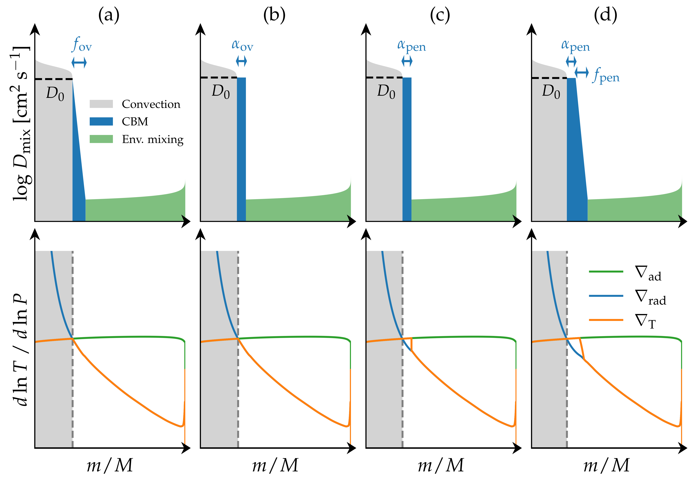
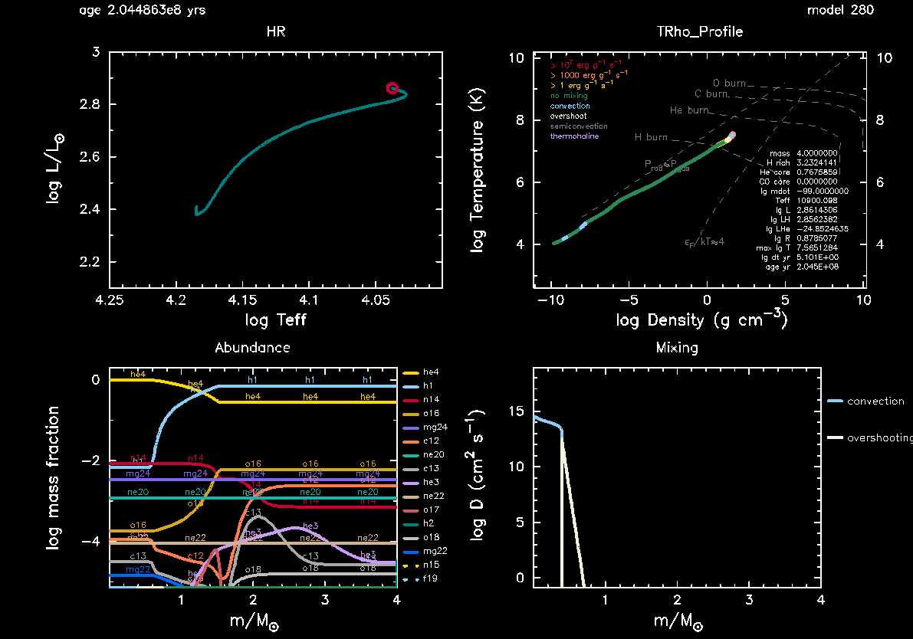

# Introduction 

(Work in progress)

Some basic introduction to the physics goes here...

     
    
 Example internal mixing profiles (top) and corresponding temperature gradients (bottom) for four different choices of covection boundary mixing (CBM): (a) Exponential diffusive overshoot, (b) step overshoot, (c) convective penetration, and (d) extended convective penetration. In the top panel, convective mixing is shown in grey, CBM is indicated in blue, while envelope mixing is shown in green. In the bottom panel the corresponding temperature gradients used by MESA ($\nabla_T$, orange) along with the adiabatic ($\nabla_{\rm ad}$, green) and radiative ($\nabla_{\rm rad}$, blue) temperature gradients are shown, with the convective core indicated by the grey region for reference. Credit: <a href="https://ui.adsabs.harvard.edu/abs/2023Galax..11...56A/abstract">Anders & Pedersen (2023)</a>. 

# Aims 

**MESA aims:** In this Minilab you will learn how to look up relevant parameters to include in your MESA `inlist`, how to load a starting model and whether or not it cares about the initial mass and chemical composition that you use in your inlist, and how to use `pgstar`.

**Science aims:** To get an understanding how convective boundary mixing in the form of exponential diffusive overshoot impacts the core masses (convective and helium), age, surface abundance of nitrogen, and the g-mode asymptotic period spacing, as well as the dependence of these parameters on the size of the overshooting region set by the parameter $f_{\rm ov}$.

# Minilab 1  

**Solution:** In case you get stuck at any point during the exercises, then you can download the solution to minilab 1 from [here](https://www.dropbox.com/s/5szt19kappiv2sd/SPB_minilab1_solutions.zip?dl=0).

In this Minilab 1, we will start constructing the `inlist` we need to study period spacing patterns in SPB stars and investigate the effect of convective boundary mixing on the asymptotic period spacing $\Pi_0$, the convective core mass $m_{\rm cc}$, and the helium core mass $m_{\rm He, core}$ obtained at the terminal-age main sequence (TAMS). As a first step, when starting a new project with `MESA`, we copy and rename the `$MESA_DIR/star/work` directory

 Terminal commands 
 

  
cp -r $MESA_DIR/star/work SPB_minilab_1  
  cd SPB_minilab_1

For good measure, let's make sure that the standard `MESA` inlist runs

 Terminal commands 
 

  
./clean & ./mk  
  ./rn

Let it run until the `pgstar` window shows up, then terminate the run using `ctrl + c`. 

<task>

Task 1

Copy and rename the <code>$MESA_DIR/star/work</code> directory as demonstrated above, then compile and run <code>MESA</code> to check that everything is running as it should.

</task>

If everything is running as it should (if not, ask your TA for help!) then it is now time to start modifying your `MESA` inlists. We will be using the same inlists throughout Minilab 1, Minilab 2, and the Maxilab and keep adding things to them as we go along. 

As `MESA` is running, you will notice that two `pgstar` windows show up. One is an HR diagram showing the evolutionary track of the star, with its current effective temperature and luminosity indicated by a red circle. The second window shows the current internal temperature versus density profile of the star, indicating also convective and other (non-)mixing regions by the colour of the profile, at what combined central densities and temperatures nuclear burning is taking place (part of the white dashed lines), the amount of generated energy (yellow, orange, and red outline of the profile), etc.

  

      

        
      

      

        
      

  

Both of these `pgstar` windows are the default windows being shown in `MESA` when you copy the `$MESA_DIR/star/work` directory. Depending on your laptop/desktop these windows might appear small and difficult to read. Fortunately, `MESA` provides a variety of parameters that we can use to make changes to the default `pgstar` windows, including their sizes. We can do so within the file `inlist_pgstar`. The `pgstar` documentation can be found [here](https://docs.mesastar.org/en/release-r23.05.1/reference/pgstar.html#). 

<task>

Task 2

Modify your <code>inlist_pgstar</code> file until you are satisfied with the sizes of your <code>pgstar</code> windows. Note that any changes that you make to <code>inlist_pgstar</code> and save while <code>MESA</code> is running are automatically updated on the fly.

</task>

<hint>

 Hint 

The two <code>pgstar</code> plotting windows are called <code>HR window</code> 
(<a href="https://docs.mesastar.org/en/release-r23.05.1/reference/pgstar.html#hr-window">documentation</a>) and <code>TRho Profile Window</code> (<a href="https://docs.mesastar.org/en/release-r23.05.1/reference/pgstar.html#trho-profile-window">documentation</a>). The names of the parameters that you should be varying are: <code>HR_win_width</code>, <code>HR_win_aspect_ratio</code>, <code>TRho_Profile_win_width</code>, and <code>TRho_Profile_win_aspect_ratio</code>. These are already included in <code>inlist_pgstar</code> by default.

</hint>

While we don't recommend using figures generated with `pgstar` in papers, these figures are very useful both for troubleshooting and making sure that `MESA` is doing what we expect it to do. This will become more clear in the Maxilab once we start to include our own custom mixing profiles in `MESA`. 

Now that the `pgstar` windows are on the right scale, we will focus on the `inlist_project` file. Usually, we want to start the evolution from the pre-main sequence, however, in an effort to save time for these labs we will instead start the evolution at the zero-age main sequence (ZAMS) using a pre-generated starting model for a $4M_\odot$ star and evolve the star until core hydrogen exhaustion. To do this, we have to modify both `&star_job` and `&controls`. 

 inlist_project 
 

<pre class="pre-filetext">
&star_job
  ...

  ! begin with a pre-main sequence model
    create_pre_main_sequence_model = .true.
  ...

/ ! end of star_job namelist

...

&controls
  ...

  ! when to stop

    ! stop when the star nears ZAMS (Lnuc/L > 0.99)
    Lnuc_div_L_zams_limit = 0.99d0
    stop_near_zams = .true.

    ! stop when the center mass fraction of h1 drops below this limit
    xa_central_lower_limit_species(1) = 'h1'
    xa_central_lower_limit(1) = 1d-3

  ...

/ ! end of controls namelist
</pre>

You can find the `&star_job` documentation [here](https://docs.mesastar.org/en/release-r23.05.1/reference/star_job.html), while the corresponding documentation website for the `&controls` parameters are located [here](https://docs.mesastar.org/en/release-r23.05.1/reference/controls.html). If you want to have a look at the inlist used to create the starting model, you can download it from [here](https://www.dropbox.com/s/elxoxppd67ojmtz/inlist_ZAMS_Y0.28_Z0.02?dl=0), but you don't need it to do these `MESA` labs.

<task>

Task 3

Modify the <code>&star_job</code> and <code>&controls</code> sections of <code>inlist_project</code> to start the evolution at the ZAMS by loading in the provided ZAMS model <a href="https://www.dropbox.com/scl/fi/qeymz61jtjn306qlwhck8/SPB_ZAMS_Y0.28_Z0.02.mod?rlkey=6yskp62mgt9zbjfm3kjl0g1nl&dl=0">SPB_ZAMS_Y0.28_Z0.02.mod</a> for a $4\,$M$_\odot$ star and stop the evolution when the core 1H mass fraction drops below 0.001. Also include an abundance window to the <code>pgstar</code> output, then try to evolve the star.

</task>

<hint>

 Hint 

The parameters that need to be changed are <code>create_pre_main_sequence_model</code> (<code>&star_job</code>) and <code>stop_near_zams</code>(<code>&controls</code>), while two additional parameters (<code>load_saved_model</code> and <code>load_model_filename</code>) have to be included in <code>&star_job</code> to load the <code>SPB_ZAMS_Y0.28_Z0.02.mod</code> file. To plot the abundance window, add <code>Abundance_win_flag = .true.</code> to <code>inlist_pgstar</code> (<a href="https://docs.mesastar.org/en/release-r23.05.1/reference/pgstar.html#abundance-window">documentation</a>).

</hint>

As `MESA` is running, you should now see a third `pgstar` window appear, showing the abundance profiles as a function of mass. The x-axis is color coded according to the internal mixing taking place in different regions of the star, and matches that being shown in the `TRho_profile` window. If you are unhappy with the size of this window, you can change in the size and aspect ratios of it in `inlist_pgstar` using the parameters `Abundance_win_width` and `Abundance_win_aspect_ratio`. 

     

 
Once the main-sequence evolution is running, we will keep modifying `inlist_project`. First we change the nuclear network to include additional reactions and isotopes relevant for the CNO-cycle. A list of default nuclear networks options availble in `MESA` are listed in the `$MESA_DIR/data/net_data/nets` directory. We refer to the `MESA` labs tomorrow for more details on nuclear networks. 

<task>

Task 4

What is the default nuclear network used by <code>MESA</code>? Change this in the <code>&star_job</code> section of <code>inlist_project</code> so <code>pp_cno_extras_o18_ne22.net</code> is used instead. Also include an abundance window to the <code>pgstar</code> output. What happens to the abundance <code>pgstar</code> window when you change the network?

</task>

<hint>

 Hint 

The parameters that need to be added in <code>inlist_project</code> are <code>change_net</code> and <code>new_net_name</code>.

</hint>

<hint>

 Hint 

Prior to changing the network, you can find out what the name of the default nuclear network is by running <code>MESA</code> and looking at the terminal output. Alternatively, you can look at the parameter <code>default_net_name</code> in the <a href="https://docs.mesastar.org/en/release-r23.05.1/reference/controls.html#nuclear-reaction-controls">nuclear networks controls</a> section of the <code>controls</code> documentation webpage.

</hint>

Next we are going to change the name of the `LOGS` directory where the `MESA` output `history.data` and `profile#.data` files gets saved in preparation of varying the convective boundary mixing of the star without overwriting previous `MESA` calculations. We will also relax the composition of the star to match the Galactic standard measured from B-type stars in the solar neighbourhood (<a href="https://ui.adsabs.harvard.edu/abs/2012A%26A...539A.143N/abstract">Nieve & Przybilla 2012</a>; <a href="https://ui.adsabs.harvard.edu/abs/2013EAS....63...13P/abstract">Przybilla et al. 2013</a>), change the opacity tables to the OP tables calculate for the metal mixture of <a href="https://ui.adsabs.harvard.edu/abs/2009ARA&A..47..481A">Asplund et al. (2009)</a> to match the initial metal mixture used in our starting model `SPB_ZAMS_Y0.28_Z0.02.mod` for the sake of consistency, and increase the frequency at which the history output is saved to the `history.data` file. 

The choice of opacity tables and metal mixtures is particularly important when we try to predict which oscillations get excited by the $\kappa$-mechanism (i.e. opacity or heat mechanism), which depending on the type of pulsating star operates in the partial ionization zones of hydrogen, helium, or iron-group elements. In the case of SPB stars, the g-mode oscillations are excited by the $\kappa$-mechanism operating in the partial inization zone of the iron-group elements, also known as the iron opacity bump or $Z$ bump. The choice of the metal mixture determines how the mass fractions of the metal isotopes (i.e. anything other than hydrogen and helium) are distributed, and highly impacts the opacities in the iron bump as demonstrated in the figure below. 

     
    
 Example Rosseland mean opacity $\kappa$ versus temperature profiles for a $10M_\odot$ star, with convective regions indicated by the vertical blue-purple zones. A default <code>MESA</code> opacity profile is shown in dashed blue. Corresponding opacity profiles resulting from increasing the opacity contribution of iron (red dashed) and both iron and nickle (full black) to the Rosseland mean opacity by 75% clearly show an increase in the opacity in the partial ionization zone of iron-group elements at around $\log T\sim 5.3$. Credit: <a href="https://ui.adsabs.harvard.edu/abs/2016MNRAS.455L..67M/abstract">Morraveji (2016)</a>.

The choice of opacities and metal mixtures will also modify the predicted oscillation frequencies (see, e.g., Figure 3 of <a href="https://ui.adsabs.harvard.edu/abs/2015A%26A...580A..27M/abstract">Morraveji et al. (2015)</a>). While new metal mixtures closer to the ones by [Grevesse & Sauval (1998)](https://ui.adsabs.harvard.edu/abs/1998SSRv...85..161G/abstract) than <a href="https://ui.adsabs.harvard.edu/abs/2009ARA&A..47..481A">Asplund et al. (2009)</a> have recently been found by [Magg et al. (2022)](https://ui.adsabs.harvard.edu/abs/2022A%26A...661A.140M/abstract), the correpsonding opacities in the Z-bump derived for the [Grevesse & Sauval (1998)](https://ui.adsabs.harvard.edu/abs/1998SSRv...85..161G/abstract) metal mixture are lower than those using <a href="https://ui.adsabs.harvard.edu/abs/2009ARA&A..47..481A">Asplund et al. (2009)</a>. Given the general need for higher opacities in the Z-bump from nickle required to explain the number of excited modes in both $\beta$ Cep and SPB stars (e.g. [Walczak et al. (2019)](https://ui.adsabs.harvard.edu/abs/2019MNRAS.485.3544W/abstract) and[Szewczuk et al. (2022)](https://ui.adsabs.harvard.edu/abs/2022MNRAS.511.1529S/abstract)), the metal mixture of <a href="https://ui.adsabs.harvard.edu/abs/2009ARA&A..47..481A">Asplund et al. (2009)</a> is used in these MESA lab exercises.
More detailed studies of mode excitation is outside the scope of these `MESA` labs and we refer instead to previous `MESA` labs by Rich Townsend and Radek Smolec from the [2019](https://cococubed.com/mesa_summer_schools/mesa_summer_school_2019/) and [2021](https://cococubed.com/mesa_summer_schools/mesa_summer_school_2021/index.html) MESA Summer Schools. 

 
<task>

Task 5

Make the following additional changes to <code>inlist_project</code>. The text in the parenthesis indicate where in the <code>inlist_project</code> file the required changes have to be made.

<ul>
<li> Change the output LOGS directory to <code>LOGS/4Msun_0fov</code> (<code>&controls</code>). </li>
<li> Relax the composition to $X=0.71$, $Y=0.276$, and $Z=0.014$ (<code>&star_job</code>, <code>&kap</code>, and <code>&controls</code>). In <code>&controls</code> add the following two parameters: <code>relax_dY = 0.001</code> and <code>relax_dlnZ = 1d-2</code>. These latter two parameters determine how quickly the composition is relaxed to the new desired values of $Y$ and $Z$. </li>
<li> Use the OP opacity tables for the <a href="https://ui.adsabs.harvard.edu/abs/2009ARA&A..47..481A">Asplund et al. (2009)</a>  metal mixture (<code>&kap</code>) and make sure to also set the <code>Zbase</code> parameter (<code>&kap</code>, <a href="https://docs.mesastar.org/en/release-r23.05.1/reference/kap.html">documentation</a>) equal to 0.014 so the base metallicity of the opacity tables match the new value of $Z$. </li>
<li> Set <code>pgstar</code> to pause before terminating (<code>&star_job</code>). </li>
<li> Output history data at every time step instead of every fifth time step (<code>&controls</code>).</li>
</ul>

</task>

<hint>

 Hint 

The parameters that need to be added in <code>&star_job</code> are: <code>relax_Y</code>, <code>new_Y</code>, <code>relax_Z</code>, <code>new_Z</code>, and <code>pause_before_terminate</code>.

</hint>

<hint>

 Hint 

The parameters that need to be added in <code>&controls</code> are: <code>log_directory</code>, <code>relax_dY = 0.001</code>, <code>relax_dlnZ = 1d-2</code>, and <code>history_interval</code>.

</hint>

<hint>

 Hint 

Concerning figuring out how to set the <code>kap_file_prefix</code> parameter, you might notice if you look up this parameter on the <code>MESA</code> documentation website that the following options are listed: <code>gn93</code>, <code>gs98</code>, <code>a09</code>, <code>OP_gs98</code>, and <code>OP_a09_nans_removed_by_hand</code>. However, no explanation is given as to what these parameters actually stand for. From the naming of the parameters you might be able to guess which one you have to use, but if you want to be sure then one way to do this is to go to your <code>$MESA_DIR/data/kap_data/</code> directory and look at the files there. In the file names, everything before <code>_z#.#_x#.#.data</code> corresponds to the input options for the <code>kap_file_prefix</code> parameter. If you choose one of the files there and open it, then the first line of the file will give you the explanation and reference to the table.

</hint>
 

Once you have implemented the changes above, try to run `MESA` and see if all the implemented changes work as they should. If you tried to change the two parameters `initial_z` and `initial_y` to match the new compositions, you will see in the terminal output that `MESA` is ignoring these changes. You may also see that although the parameter `initial_mass = 15` is still set in the `inlist_project` file, then this choice of initial mass is also being ignored. As a reminder, the mass of the loaded model is $4M_\odot$.

 Terminal output 
 

<pre class="pre-terminal">
 ___________  ...  ___________   ...	_________ ...

       step   ...  Mass          ...	Y_surf    ...
  lg_dt_yrs   ...  lg_Mdot       ...	Z_surf    ...
    age_yrs   ...  lg_Dsurf      ...	Z_cntr    ...
 ___________  ...  ___________   ...	_________ ...
 
        240   ...  4.000000      ...	0.280000  ...
 6.3041E+00   ...  -99.000000    ...	0.020000  ...
 1.0143E+08   ...  -9.311364     ...	0.019646  ...
</pre>

This is because the initial mass and composition have already been set by the input `MESA` model `SPB_ZAMS_Y0.28_Z0.02.mod`, which we are telling `MESA` to load. If we wanted to change these values, then we can relax the composition of the input model (as we are doing in this minilab) and likewise we can relax the inital mass of the model.

Once your new `inlist_project` is working, the next step is to start including convective boundary mixing. Before doing so, lets adjust the plotting window of the `pgstar` HR diagram and include one additional `pgstar` plotting window showing the mixing profile. You may also notice that the evolutionary track showing up in the `HR window` only takes up a small part of the `pgstar` plot. This is because we are now considering a $4M_\odot$ star instead of the default $15M_\odot$ star, and we are focusing only on the main-sequence evolution. An example comparion of the `HR window` before and after zooming in on the evolutionary track is shown below. 

  

      

        
        
 New <code>HR window</code> before modifying x- and y-axes limits.

      

      

        
        
 Example new <code>HR window</code> after modifying x- and y-axes limits.

      

  

 

<task>

Task 6

Zoom in on the MS evolutionary track of the start in the <code>pgstar</code> HR window and include an additional <code>pgstar</code> window showing the mixing profile. 

</task>

<hint>

 Hint 

Modify the four input parameters <code>HR_logT_min</code>, <code>HR_logT_max</code>, <code>HR_logL_min</code>, and <code>HR_logL_max</code> in <code>inlist_pgstar</code>. You can do this on the fly while <code>MESA</code> is running. Look up "Mixing window" in the <code>MESA</code> <code>pgstar</code> <a href="https://docs.mesastar.org/en/release-r23.05.1/reference/pgstar.html#mixing-window">documentation</a>. The parameter you want to add to <code>inlist_pgstar</code> is <code>Mixing_win_flag</code>.

</hint>
 

The final input parameters we want to add to `inlist_project` are related to the convective boundary mixing. For this exercise we will only consider exponential diffusive overshoot on top of the hydrogen burning convective core: 

$$D_{\rm ov} (r) = D_0 \exp \left(\frac{-2 \left[r-r_0\right]}{f_{\rm ov} H_{\rm p,0}} \right)$$

This type of mixing is one out of two overshoot mixing schemes that have been implemented in `MESA`. $D_0$ is the diffusive mixing coefficient at $r_0 = r_{\rm cc} - f_0 H_{\rm p,cc}$ , i.e. at a step of $f_0 H_{\rm p,cc}$  inside the convective core boundary at radius coordinate $r_{\rm cc}$. This step is required because the diffusive mixing coefficient for the convective zone approaches zero at the core boundary. $H_{\rm p,0}$ is the pressure scale height at $r_0$, $H_{\rm p, cc}$ is the pressure scale height at $r_{\rm cc}$, and $f_{\rm ov}$ is the overshoot parameter. For this exercise, we will fix $f_0 = 0.002$  and vary $f_{\rm ov}$ from 0.005 to 0.04.

<task>

Task 7

Look up the parameters required to include convective boundary mixing (overshoot) in <code>MESA</code>. Include these parameters in <code>inlist_project</code> (<code>&controls</code>), replace the (:) with (1), set the overshoot scheme to exponential on top of the core during hydrogen burning, set $f_0 = 0.002$, and choose a value for $f_{\rm ov}$ between 0.005 to 0.04. Run <code>MESA</code>. Change the name of your output LOGS directory <code>LOGS/4Msun_#fov</code> so that <code>#</code> corresponds to your choice of $f_{\rm ov}$. What happens to the <code>pgstar</code> mixing and HR windows? Note that models with a higher $f_{\rm ov}$ parameter will take longer to run, so if your laptop is slow make sure to choose a low value and have someone else at your table choose a high value.

</task>

<hint>

 Hint 

The parameters to be added to <code>&controls</code> in <code>inlist_project</code> are: <code>overshoot_scheme(1)</code>, <code>overshoot_zone_type(1)</code>, <code>overshoot_zone_loc(1)</code>, <code>overshoot_bdy_loc(1)</code>, <code>overshoot_f(1)</code>, and <code>overshoot_f0(1) = 0.002</code>. <code>overshoot_f(1)</code> is the overshooting parameter that you will be varying.

</hint>
 

<task>

Task 8

Include <code>overshoot_D_min = 1d-2</code> in <code>inlist_project</code> (<code>&controls</code>). What happens to the mixing profile shown in your mixing window? What is the default value of <code>overshoot_D_min</code>?

</task>

Your final `pgstar` mixing window should end up looking something like this depending on your choice of $f_{\rm ov}$:

     

 

Now that we have the desired physics included in our `MESA` inlists, it is time to see how exponential diffusive overshooting impacts the convective core mass ($m_{\rm cc}$), the helium core mass obtained that the TAMS ($m_{\rm He, core}$), the age of the star at the TAMS ($\tau_{\rm TAMS}$), the 14N mass fraction at the surface <i>X</i>(14N)surf, and the asymptotic period spacing of $\ell =1$ g-modes ($\Pi_{\ell=1}$). To do so, we first have to make sure that these are included as part of the history output.

<task>

Task 9

Copy <code>history_columns.list</code> from <code>$MESA_DIR/star/defaults</code> to <code>SPB_minilab_1</code>. Make sure that the following parameters are included in <code>history_columns.list</code>: <code>mass_conv_core</code>, <code>he_core_mass</code>, <code>surface_n14</code>, <code>center_h1</code>,
and <code>delta_Pg</code>. Also add the parameter <code>delta_Pg_mode_freq = 20</code> to your <code>inlist_project</code> file under <code>&controls</code>.
Run <code>MESA</code> and answer/do the following:

<ul>
<li> In the  <a href="https://docs.google.com/spreadsheets/d/1KrAoaLLOtSo-p8H_E2XO77FEUni6PugNR7jKK6_I71c/edit#gid=713862144">Google spreadsheet</a> note down your name and choice of $f_{\rm ov}$, as well as $m_{\rm He, core}$, $\tau_{\rm TAMS}$, and $X(^{14}{\rm N})_{\rm surf}$ at TAMS. </li>
<li> Find the value of $\Pi_{\ell=1}$ and $m_{\rm cc}$ at <code>center_h1 &sim; 0.35</code> (i.e. halfway through core hydrogen burning) and add these to the Google spreadsheet.</li>
<li> How do these values change for different values of $f_{\rm ov}$?</li>
</ul>

</task>

<hint>

 Hint 

The convective core mass (<code>mass_conv_core</code>), helium core mass (<code>he_core_mass</code>), star age (<code>star_age</code>), and center 1H mass fraction (<code>center_h1</code>) parameters are already included in the history output by default. The only additional ones you have to add are <code>surface_n14</code> and <code>delta_Pg</code>.

</hint>

<hint>

 Hint 

When finding the values at <code>center_h1 &sim; 0.35</code> just select the ones that are closest to this value.

</hint>

## Bonus exercise: Combining multiple pgstar plots in one window  

Currently, when running MESA you have four `pgstar` windows open at once. This is starting to get a bit busy. MESA actually has options for including multiple `pgstar` plots in the same window! For this bonus exercise, we will do just that. To get our (currently) four `pgstar` windows into one window, we'll make use of a so-called grid. You can activate a total of nine such grids, and each grid can contain multiple plots. Today, we'll only use one grid.
 

<task>

Task B1

Add the relevant inlist settings to <code>inlist_pgstar</code> to create a grid with 2 rows, 2 columns and 4 plots. Don't worry about trying to include your individual <code>pgstar</code> plots in the grid just yet. Also make sure to include the two parameters <code>log_center_T</code> and <code>log_center_Rho</code> in your <code>history_columns.list</code> file, otherwise MESA will give an error right after relaxing the composition. Then run MESA. 

</task>

<hint>

 Hint 

You'll find the relevant settings under the <code>Grid</code> section of the <code>pgstar</code> <a href="https://docs.mesastar.org/en/release-r23.05.1/reference/pgstar.html#grid">documentation</a>.

</hint>
 

When running the model, you'll see a fifth `pgstar` window appear, in which the central $T\text{--}\rho$ evolution is shown again. We obviously want to get rid of the individual windows first and then start filling our grid.

<task>

Task B2

Disable the individual <code>pgstar</code> windows. Afterwards, add them to the grid instead. You can do this using the <code>Grid1_plot_name(:)</code> array by replacing the <code>:</code> with 1, 2, 3 and 4, respectively. Do not remove the other inlist settings such as <code>HR_logT_min</code> and <code>show_TRho_Profile_legend = .true.</code>. They will still apply to our plots, even though they live in the grid now.

</task>

<hint>

 Hint 

The names required to add the desired plots to the grid are the same as those used for the individual <code>pgstar</code> windows. For example: to add the $T\text{-}\rho$-profile (previously enabled by <code>TRho_Profile_win_flag = .true.</code>), the name should be <code>TRho_profile</code>.

</hint>
 

What we want to do next, before running our model again, is assign each of our four plots to a location on the grid. We can do this by specifying the row and column number. We also want to make sure each plot only takes up the width and height of one column and row, respectively.

<task>

Task B3

Find the inlist settings to assign each plot (<code>HR</code>, <code>TRho_profile</code>, <code>Abundance</code> and <code>Mixing</code>) to a location in the grid, and make sure they only span one column width and row height. You can choose for yourself where in the grid you want which plot. After you've done this, run the model again.

</task>

<hint>

 Hint 

Just as for the <code>Grid1_plot_name(:)</code>, the row(span)/column(span) settings are handled by an array.

</hint>

<hint>

 Hint 

The row/column indices in our $2\times 2$ grid are $[1,\,2]$.

</hint>
 

If you've run the model, chances are that the `pgstar` window looks quite horrible now, with overlapping plots etc. To make the window prettier, we're going to have to play with some of the window dimensions, individual plot padding, and scaling settings. Now for some good news and some bad news. The bad news is that these settings depend on what kind of screen you're working on. The specific settings in the solution below work for the laptop of the person writing this, but not necessarily for yours. The good news is that you can adjust the inlist settings during the run. Simply saving `inlist_pgstar` will apply your settings to the `pgstar` window while MESA is running.

<task>

Task B4

Adjust the settings for the grid window dimensions, padding for the individual plots, and text scale factors to make each plot fit nicely in the <code>pgstar</code> window. Run the model until you're satisfied with how the <code>pgstar</code> window is looking.

</task>

<hint>

 Hint 

The <code>pgstar</code> parameters you need to add and vary are:
<ul>
 <li><code>Grid1_win_width</code> </li>
 <li><code>Grid1_win_aspect_ratio</code> </li>
 <li><code>Grid1_plot_pad_left(:)</code> </li>
 <li><code>Grid1_plot_pad_right(:)</code> </li>
 <li><code>Grid1_plot_pad_top(:)</code> </li>
 <li><code>Grid1_plot_pad_bot(:)</code> </li>
 <li><code>Grid1_txt_scale_factor(:)</code> </li>
</ul>

</hint>
 

If all went well, your `inlist_pgstar` should look something like the one below. In the next labs, you will need to add additional `pgstar` plots. If you have time left, you can always try to add them to the grid you just made! 

 inlist_pgstar
 

<pre class="pre-filetext">
&pgstar

! Grid window settings
  Grid1_win_flag = .true.
  Grid1_win_width = 18
  Grid1_win_aspect_ratio = 0.65
  Grid1_num_cols = 2
  Grid1_num_rows = 2
  Grid1_num_plots = 4

! HRD
  Grid1_plot_name(1) = 'HR'
  Grid1_plot_row(1) = 1
  Grid1_plot_rowspan(1) = 1
  Grid1_plot_col(1) = 1
  Grid1_plot_colspan(1) = 1
  Grid1_plot_pad_left(1) = 0.0
  Grid1_plot_pad_right(1) = 0.05
  Grid1_plot_pad_top(1) = 0.0
  Grid1_plot_pad_bot(1) = 0.05
  Grid1_txt_scale_factor(1) = 0.7
  HR_logT_min = 4.0
  HR_logT_max = 4.25
  HR_logL_min = 2.1
  HR_logL_max = 3.0

! Temperature-density profile
  Grid1_plot_name(2) = 'TRho_profile'
  Grid1_plot_row(2) = 1
  Grid1_plot_rowspan(2) = 1
  Grid1_plot_col(2) = 2
  Grid1_plot_colspan(2) = 1
  Grid1_plot_pad_left(2) = 0.05
  Grid1_plot_pad_right(2) = 0.0
  Grid1_plot_pad_top(2) = 0.0
  Grid1_plot_pad_bot(2) = 0.05
  Grid1_txt_scale_factor(2) = 0.7
  show_TRho_Profile_legend = .true.
  show_TRho_Profile_text_info = .true.

! Abundances
  Grid1_plot_name(3) = 'Abundance'
  Grid1_plot_row(3) = 2
  Grid1_plot_rowspan(3) = 1
  Grid1_plot_col(3) = 1
  Grid1_plot_colspan(3) = 1
  Grid1_plot_pad_left(3) = 0.0
  Grid1_plot_pad_right(3) = 0.1
  Grid1_plot_pad_top(3) = 0.075
  Grid1_plot_pad_bot(3) = 0.0
  Grid1_txt_scale_factor(3) = 0.7

! Mixing
  Grid1_plot_name(4) = 'Mixing'
  Grid1_plot_row(4) = 2
  Grid1_plot_rowspan(4) = 1
  Grid1_plot_col(4) = 2
  Grid1_plot_colspan(4) = 1
  Grid1_plot_pad_left(4) = 0.05
  Grid1_plot_pad_right(4) = 0.05
  Grid1_plot_pad_top(4) = 0.075
  Grid1_plot_pad_bot(4) = 0.0
  Grid1_txt_scale_factor(4) = 0.7

/ ! end of pgstar namelist
</pre>

 

The corresponding `pgstar` grid window should look something like this.

     

